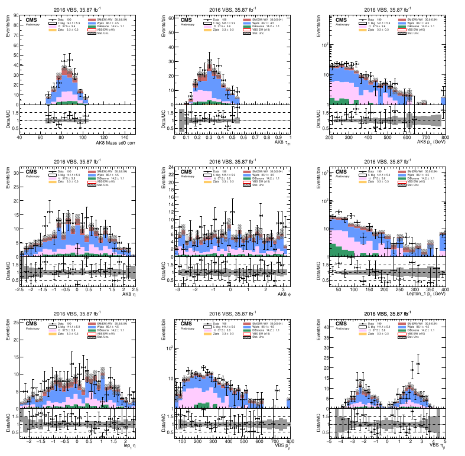

# Introduction

This is a simple webpage/webbook put together for the purpose of keeping my advisor up to date on my research and thesis progress. It's also supposed to help me remember what I've done and hopefully why I've done things the way that I did. All of the pages are written in markdown for easy writing and the HTML & CSS are all automatically generated using the mdbook program written in Rust.

I'm testing out using the mdbook features to write my update page because it will be easier to write out markdown files than the html directly. There's a button at the top left for toggling the table of contents and a paintbrush button for selecting the theme/colors of the page.

I can't do as much as if I wrote the pages directly, but it should do the job well enough. The program is meant to be used for writing web documentation and books (hence the name mdbook) but it should be fine for this purpose.

Below are just some tests of the functionality.

- [x] Using an image as a link

- [x] Changing the color of the text.
- [x] using \\( \LaTeX \\) in the page
- [x] using superscript and subscript  
